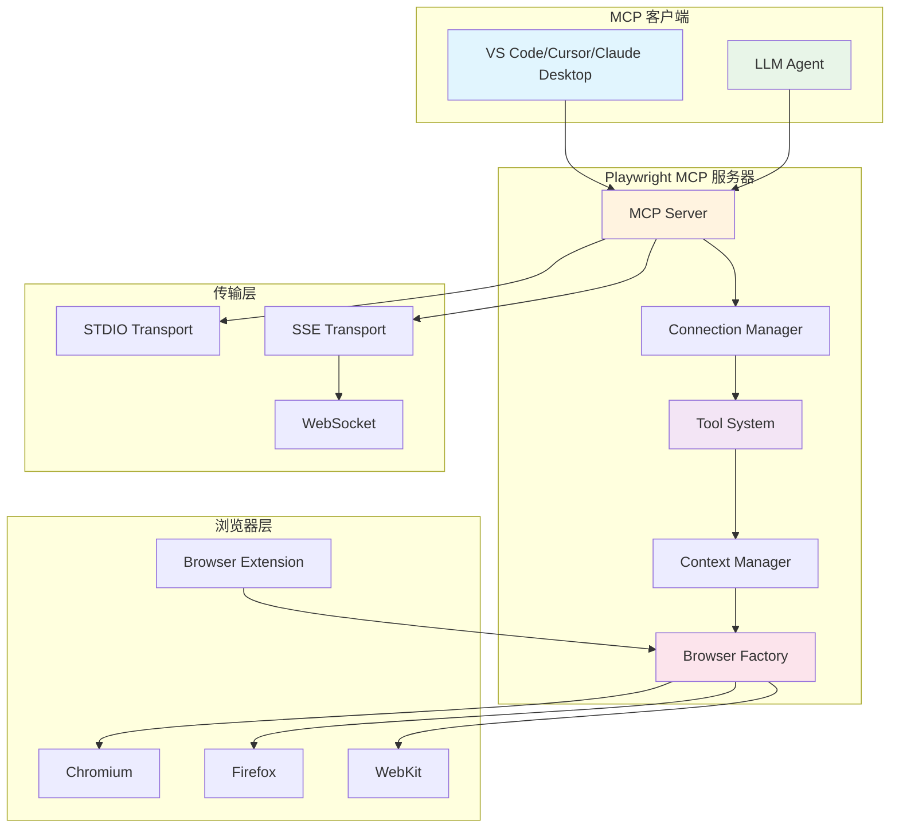
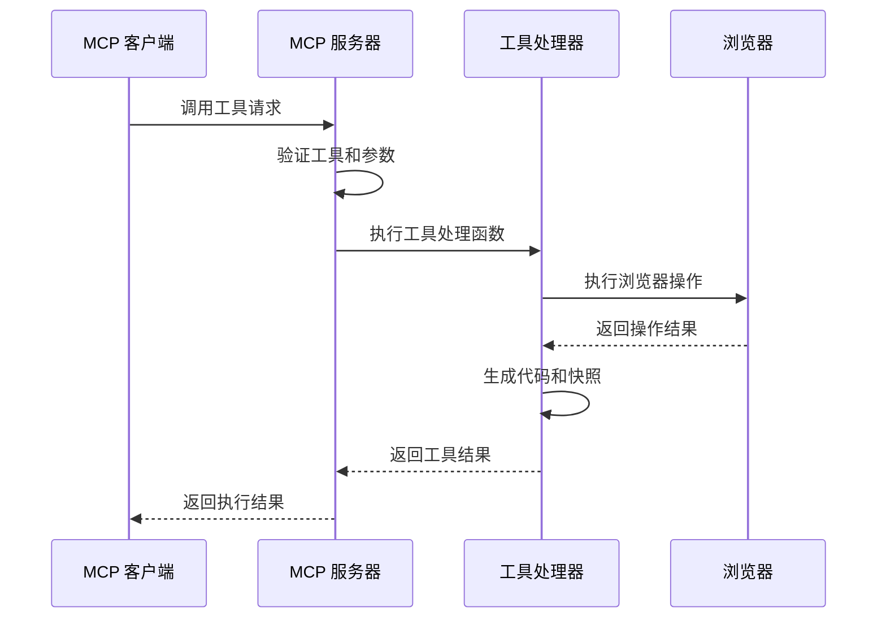
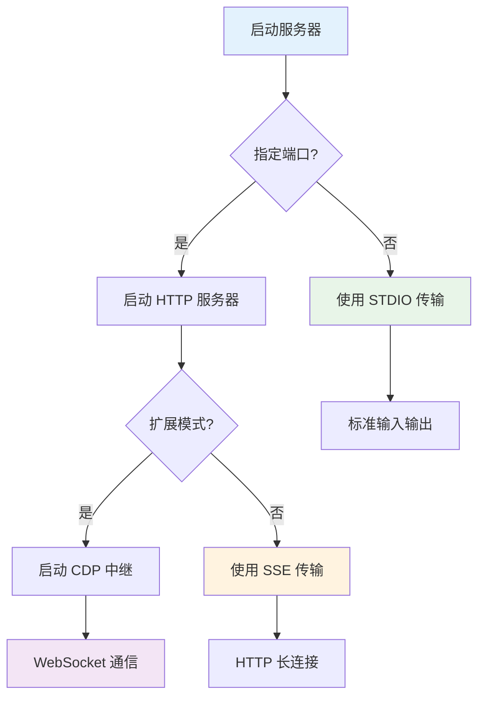
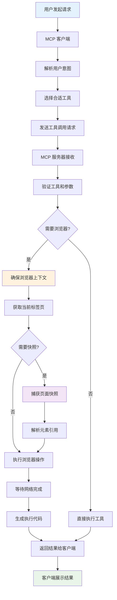
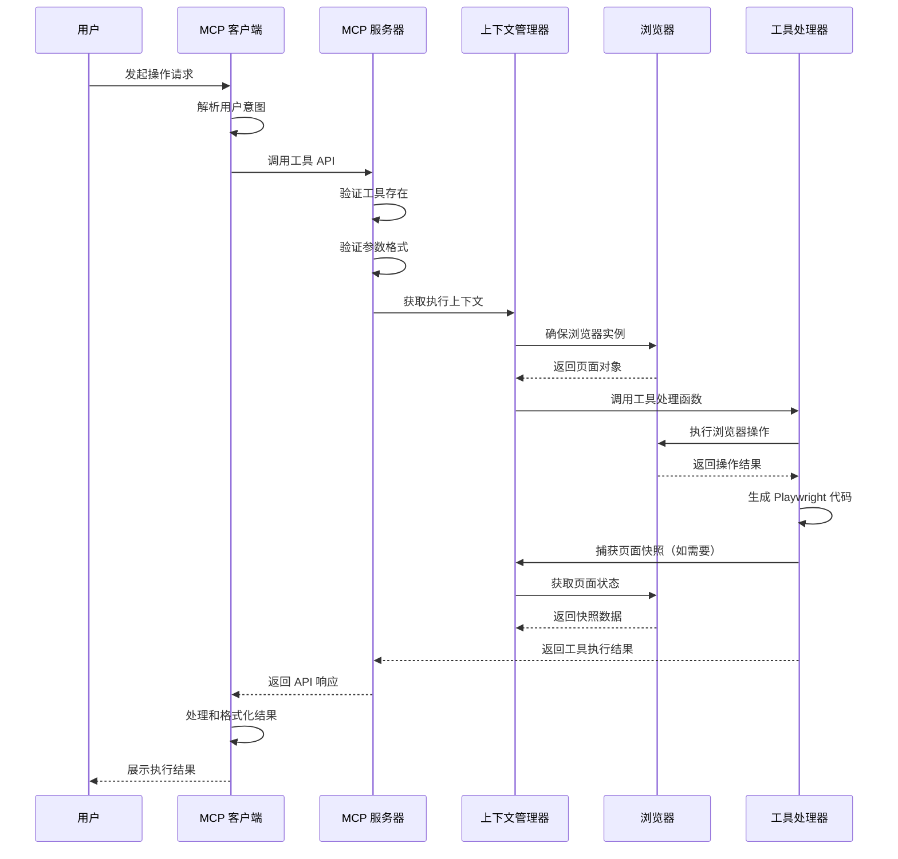
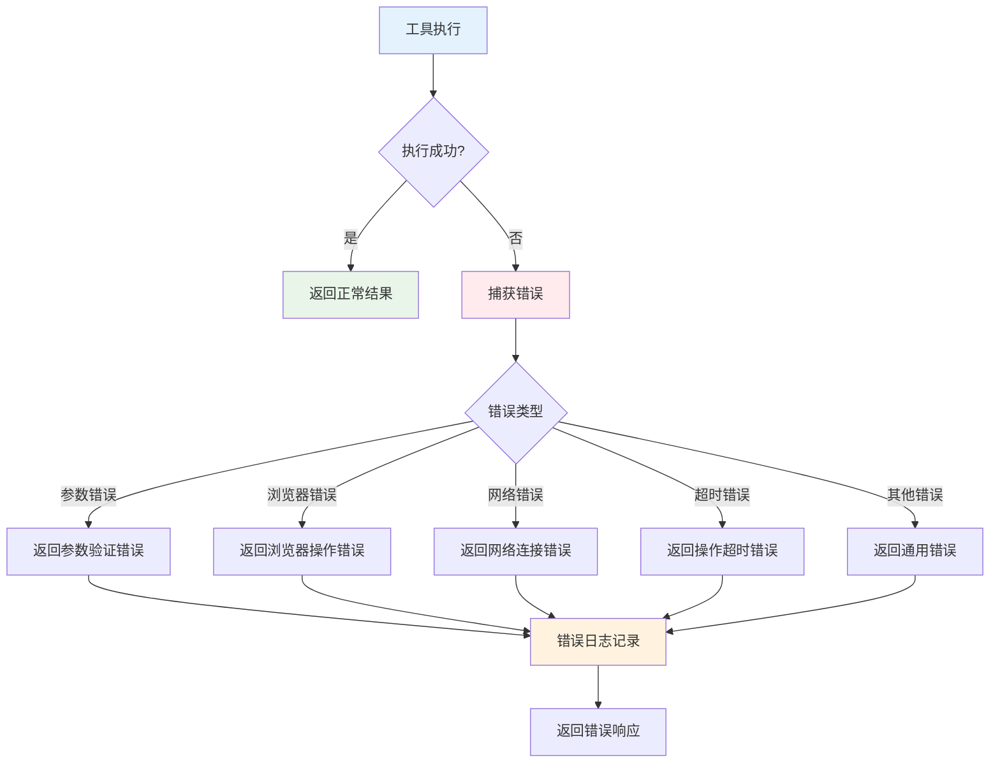

# Playwright MCP 技术文档

## 目录

- [项目概述](#项目概述)
- [技术栈说明](#技术栈说明)
- [项目架构设计](#项目架构设计)
- [目录结构详解](#目录结构详解)
- [安装和运行指南](#安装和运行指南)
- [API接口文档](#api接口文档)
- [核心功能模块详解](#核心功能模块详解)
- [数据流程说明](#数据流程说明)
- [配置文件说明](#配置文件说明)
- [开发指南和最佳实践](#开发指南和最佳实践)
- [常见问题和故障排除](#常见问题和故障排除)

## 项目概述

Playwright MCP 是一个基于 Model Context Protocol (MCP) 的服务器，它提供了强大的浏览器自动化功能。该项目使用 [Playwright](https://playwright.dev) 作为底层浏览器自动化引擎，让大语言模型 (LLM) 能够通过结构化的可访问性快照与网页进行交互，而无需依赖截图或视觉调优模型。

### 核心特性

- **快速轻量**：使用 Playwright 的可访问性树，而非基于像素的输入方式
- **LLM 友好**：无需视觉模型，完全基于结构化数据操作
- **确定性工具应用**：避免了基于截图方法常见的歧义性问题
- **多浏览器支持**：支持 Chromium、Firefox 和 WebKit
- **双模式操作**：支持快照模式（默认）和视觉模式
- **扩展性强**：模块化的工具系统，易于扩展新功能

### 应用场景

- **自动化测试**：生成和执行 Playwright 测试脚本
- **网页数据抓取**：智能提取网页内容和数据
- **用户界面自动化**：模拟用户操作，如点击、输入、导航等
- **网页监控**：定期检查网页状态和内容变化
- **辅助开发**：协助开发者进行网页调试和测试

## 技术栈说明

### 后端技术栈

- **Node.js (≥18)**：JavaScript 运行时环境
- **TypeScript**：提供类型安全的 JavaScript 开发体验
- **Playwright 1.53.0**：跨浏览器自动化库
- **Model Context Protocol SDK**：MCP 协议实现
- **Commander.js**：命令行接口框架
- **WebSocket (ws)**：实时通信协议
- **Zod**：TypeScript 优先的模式验证库

### 开发工具

- **ESLint**：代码质量检查工具
- **Playwright Test**：端到端测试框架
- **TypeScript Compiler**：TypeScript 编译器
- **Docker**：容器化部署支持

### 浏览器支持

- **Chromium/Chrome**：默认浏览器，支持最新特性
- **Microsoft Edge**：基于 Chromium 的浏览器
- **Firefox**：Mozilla 浏览器引擎
- **WebKit**：Safari 浏览器引擎

### 协议和标准

- **Model Context Protocol (MCP)**：LLM 工具集成标准
- **Chrome DevTools Protocol (CDP)**：浏览器调试协议
- **Server-Sent Events (SSE)**：服务器推送事件
- **WebSocket**：双向通信协议

## 项目架构设计

### 系统架构图



### 核心组件说明

1. **MCP Server**：实现 MCP 协议的核心服务器
2. **Connection Manager**：管理客户端连接和会话
3. **Tool System**：工具注册、验证和执行系统
4. **Context Manager**：浏览器上下文和状态管理
5. **Browser Factory**：浏览器实例创建和配置
6. **Transport Layer**：支持多种传输协议

## 目录结构详解

```
playwright-mcp/
├── src/                          # 源代码目录
│   ├── tools/                    # 工具实现目录
│   │   ├── common.ts            # 通用工具（关闭、调整大小）
│   │   ├── console.ts           # 控制台消息工具
│   │   ├── dialogs.ts           # 对话框处理工具
│   │   ├── files.ts             # 文件上传工具
│   │   ├── install.ts           # 浏览器安装工具
│   │   ├── keyboard.ts          # 键盘操作工具
│   │   ├── navigate.ts          # 页面导航工具
│   │   ├── network.ts           # 网络请求工具
│   │   ├── pdf.ts               # PDF 生成工具
│   │   ├── screenshot.ts        # 截图工具
│   │   ├── snapshot.ts          # 页面快照工具
│   │   ├── tabs.ts              # 标签页管理工具
│   │   ├── testing.ts           # 测试生成工具
│   │   ├── tool.ts              # 工具基础类型定义
│   │   ├── utils.ts             # 工具辅助函数
│   │   ├── vision.ts            # 视觉模式工具
│   │   └── wait.ts              # 等待工具
│   ├── browserContextFactory.ts # 浏览器上下文工厂
│   ├── browserServer.ts         # 浏览器服务器
│   ├── cdpRelay.ts              # CDP 中继服务器
│   ├── config.ts                # 配置管理
│   ├── connection.ts            # MCP 连接管理
│   ├── context.ts               # 执行上下文管理
│   ├── fileUtils.ts             # 文件工具函数
│   ├── httpServer.ts            # HTTP 服务器
│   ├── index.ts                 # 主入口文件
│   ├── javascript.ts            # JavaScript 代码生成
│   ├── manualPromise.ts         # 手动 Promise 实现
│   ├── package.ts               # 包信息
│   ├── pageSnapshot.ts          # 页面快照处理
│   ├── program.ts               # 命令行程序
│   ├── server.ts                # 服务器主类
│   ├── tab.ts                   # 标签页管理
│   ├── tools.ts                 # 工具集合导出
│   └── transport.ts             # 传输层实现
├── extension/                    # 浏览器扩展
│   ├── icons/                   # 扩展图标
│   ├── background.js            # 后台脚本
│   ├── manifest.json            # 扩展清单
│   ├── popup.html               # 弹出页面
│   └── popup.js                 # 弹出脚本
├── tests/                       # 测试文件目录
├── utils/                       # 工具脚本
├── examples/                    # 示例文件
├── cli.js                       # 命令行入口
├── index.js                     # 包主入口
├── package.json                 # 项目配置
├── tsconfig.json                # TypeScript 配置
├── playwright.config.ts         # Playwright 测试配置
├── eslint.config.mjs            # ESLint 配置
├── Dockerfile                   # Docker 配置
└── README.md                    # 项目说明
```

### 关键文件说明

- **cli.js**：命令行工具入口，启动 MCP 服务器
- **src/index.ts**：程序化使用的主入口
- **src/program.ts**：命令行参数解析和程序启动逻辑
- **src/server.ts**：MCP 服务器主类，管理连接和生命周期
- **src/connection.ts**：单个 MCP 连接的管理
- **src/context.ts**：浏览器执行上下文和状态管理
- **src/tools.ts**：所有工具的集合和导出
- **src/config.ts**：配置文件解析和默认配置

## 安装和运行指南

### 环境要求

- **Node.js**：版本 18 或更高
- **操作系统**：Windows、macOS 或 Linux
- **内存**：建议至少 2GB 可用内存
- **磁盘空间**：至少 1GB 可用空间（用于浏览器下载）

### 快速开始

#### 1. 通过 NPM 安装（推荐）

```bash
# 全局安装
npm install -g @playwright/mcp

# 或者直接使用 npx（无需安装）
npx @playwright/mcp@latest --help
```

#### 2. 在 MCP 客户端中配置

**VS Code 配置：**
```json
{
  "mcpServers": {
    "playwright": {
      "command": "npx",
      "args": ["@playwright/mcp@latest"]
    }
  }
}
```

**Claude Desktop 配置：**
```json
{
  "mcpServers": {
    "playwright": {
      "command": "npx",
      "args": ["@playwright/mcp@latest"]
    }
  }
}
```

#### 3. 启动服务器

```bash
# 默认启动（STDIO 模式）
npx @playwright/mcp@latest

# 启动 HTTP 服务器模式
npx @playwright/mcp@latest --port 8931

# 启动无头模式
npx @playwright/mcp@latest --headless

# 指定浏览器
npx @playwright/mcp@latest --browser firefox
```

### 开发环境安装

#### 1. 克隆项目

```bash
git clone https://github.com/microsoft/playwright-mcp.git
cd playwright-mcp
```

#### 2. 安装依赖

```bash
npm install
```

#### 3. 构建项目

```bash
npm run build
```

#### 4. 运行测试

```bash
npm test
```

#### 5. 启动开发服务器

```bash
# 监听模式构建
npm run watch

# 在另一个终端启动服务器
node lib/program.js
```

### Docker 部署

#### 1. 使用预构建镜像

```bash
docker run -i --rm --init --pull=always mcr.microsoft.com/playwright/mcp
```

#### 2. 构建自定义镜像

```bash
# 构建镜像
docker build -t playwright-mcp .

# 运行容器
docker run -i --rm --init playwright-mcp
```

#### 3. Docker Compose 配置

```yaml
version: '3.8'
services:
  playwright-mcp:
    image: mcr.microsoft.com/playwright/mcp
    ports:
      - "8931:8931"
    environment:
      - DISPLAY=:99
    command: ["--port", "8931", "--headless"]
```

### 浏览器扩展安装

#### 1. 安装扩展

1. 打开 Chrome/Edge 浏览器
2. 进入扩展管理页面
3. 启用"开发者模式"
4. 点击"加载已解压的扩展程序"
5. 选择项目中的 `extension` 目录

#### 2. 配置扩展模式

```bash
# 启动扩展模式服务器
npx @playwright/mcp@latest --port 8931 --extension
```

#### 3. 连接浏览器标签页

1. 在浏览器中打开要控制的页面
2. 点击扩展图标
3. 点击"Share with Playwright MCP"

## API接口文档

Playwright MCP 提供了丰富的工具集，分为两种操作模式：

### 操作模式

#### 1. 快照模式（默认）
- 使用可访问性快照进行元素定位
- 更快的执行速度和更好的可靠性
- 适合大多数自动化场景

#### 2. 视觉模式
- 使用截图进行视觉交互
- 支持坐标点击和拖拽
- 适合需要精确视觉定位的场景

```bash
# 启用视觉模式
npx @playwright/mcp@latest --vision
```

### 核心工具分类

#### 交互工具

**browser_snapshot**
- **描述**：捕获当前页面的可访问性快照
- **参数**：无
- **返回**：页面结构化快照数据
- **只读**：是

**browser_click**
- **描述**：在网页上执行点击操作
- **参数**：
  - `element` (string)：元素的人类可读描述
  - `ref` (string)：页面快照中的精确元素引用
- **只读**：否

**browser_type**
- **描述**：在可编辑元素中输入文本
- **参数**：
  - `element` (string)：元素描述
  - `ref` (string)：元素引用
  - `text` (string)：要输入的文本
  - `submit` (boolean, 可选)：是否在输入后按回车
  - `slowly` (boolean, 可选)：是否逐字符输入
- **只读**：否

**browser_hover**
- **描述**：悬停在页面元素上
- **参数**：
  - `element` (string)：元素描述
  - `ref` (string)：元素引用
- **只读**：是

**browser_drag**
- **描述**：在两个元素之间执行拖拽操作
- **参数**：
  - `startElement` (string)：起始元素描述
  - `startRef` (string)：起始元素引用
  - `endElement` (string)：目标元素描述
  - `endRef` (string)：目标元素引用
- **只读**：否

#### 导航工具

**browser_navigate**
- **描述**：导航到指定 URL
- **参数**：
  - `url` (string)：要导航到的 URL
- **只读**：否

**browser_navigate_back**
- **描述**：返回上一页
- **参数**：无
- **只读**：是

**browser_navigate_forward**
- **描述**：前进到下一页
- **参数**：无
- **只读**：是

#### 资源工具

**browser_take_screenshot**
- **描述**：截取当前页面截图
- **参数**：
  - `raw` (boolean, 可选)：是否返回未压缩的 PNG 格式
  - `filename` (string, 可选)：保存文件名
  - `element` (string, 可选)：要截图的元素描述
  - `ref` (string, 可选)：元素引用
- **只读**：是

**browser_pdf_save**
- **描述**：将页面保存为 PDF
- **参数**：
  - `filename` (string, 可选)：PDF 文件名
- **只读**：是

**browser_network_requests**
- **描述**：获取页面加载以来的所有网络请求
- **参数**：无
- **只读**：是

**browser_console_messages**
- **描述**：获取所有控制台消息
- **参数**：无
- **只读**：是

#### 标签页管理工具

**browser_tab_list**
- **描述**：列出所有浏览器标签页
- **参数**：无
- **只读**：是

**browser_tab_new**
- **描述**：打开新标签页
- **参数**：
  - `url` (string, 可选)：新标签页要导航的 URL
- **只读**：是

**browser_tab_select**
- **描述**：选择指定标签页
- **参数**：
  - `index` (number)：标签页索引
- **只读**：是

**browser_tab_close**
- **描述**：关闭标签页
- **参数**：
  - `index` (number, 可选)：要关闭的标签页索引
- **只读**：否

#### 实用工具

**browser_wait_for**
- **描述**：等待文本出现、消失或指定时间
- **参数**：
  - `time` (number, 可选)：等待时间（秒）
  - `text` (string, 可选)：等待出现的文本
  - `textGone` (string, 可选)：等待消失的文本
- **只读**：是

**browser_file_upload**
- **描述**：上传一个或多个文件
- **参数**：
  - `paths` (array)：要上传的文件绝对路径
- **只读**：否

**browser_handle_dialog**
- **描述**：处理浏览器对话框
- **参数**：
  - `accept` (boolean)：是否接受对话框
  - `promptText` (string, 可选)：提示对话框的文本
- **只读**：否

**browser_press_key**
- **描述**：按下键盘按键
- **参数**：
  - `key` (string)：按键名称或字符，如 `ArrowLeft` 或 `a`
- **只读**：否

**browser_install**
- **描述**：安装配置中指定的浏览器
- **参数**：无
- **只读**：否

**browser_close**
- **描述**：关闭浏览器
- **参数**：无
- **只读**：是

**browser_resize**
- **描述**：调整浏览器窗口大小
- **参数**：
  - `width` (number)：窗口宽度
  - `height` (number)：窗口高度
- **只读**：是

#### 测试工具

**browser_generate_playwright_test**
- **描述**：为给定场景生成 Playwright 测试
- **参数**：
  - `name` (string)：测试名称
  - `description` (string)：测试描述
  - `steps` (array)：测试步骤
- **只读**：是

### 视觉模式专用工具

当启用 `--vision` 模式时，可使用以下基于坐标的工具：

**browser_screen_capture**
- **描述**：截取当前页面截图
- **参数**：无
- **只读**：是

**browser_screen_move_mouse**
- **描述**：移动鼠标到指定位置
- **参数**：
  - `element` (string)：元素描述
  - `x` (number)：X 坐标
  - `y` (number)：Y 坐标
- **只读**：是

**browser_screen_click**
- **描述**：在指定坐标点击鼠标左键
- **参数**：
  - `element` (string)：元素描述
  - `x` (number)：X 坐标
  - `y` (number)：Y 坐标
- **只读**：否

**browser_screen_drag**
- **描述**：拖拽鼠标左键
- **参数**：
  - `element` (string)：元素描述
  - `startX` (number)：起始 X 坐标
  - `startY` (number)：起始 Y 坐标
  - `endX` (number)：结束 X 坐标
  - `endY` (number)：结束 Y 坐标
- **只读**：否

**browser_screen_type**
- **描述**：输入文本
- **参数**：
  - `text` (string)：要输入的文本
  - `submit` (boolean, 可选)：是否在输入后按回车
- **只读**：否

## 核心功能模块详解

### 1. 工具系统 (Tool System)

工具系统是 Playwright MCP 的核心，负责定义、注册和执行各种浏览器操作。

#### 工具定义结构

```typescript
type Tool<Input> = {
  capability: ToolCapability;     // 工具能力类别
  schema: ToolSchema<Input>;      // 工具模式定义
  clearsModalState?: ModalState['type']; // 清除的模态状态
  handle: (context: Context, params: Input) => Promise<ToolResult>; // 处理函数
};
```

#### 工具能力分类

- **core**：核心浏览器操作（点击、输入、导航等）
- **tabs**：标签页管理
- **pdf**：PDF 生成
- **history**：浏览器历史
- **wait**：等待工具
- **files**：文件处理
- **install**：浏览器安装
- **testing**：测试生成

#### 工具执行流程



### 2. 浏览器上下文管理 (Browser Context Management)

#### 上下文工厂模式

```typescript
interface BrowserContextFactory {
  create(): Promise<{
    browserContext: BrowserContext;
    close: () => Promise<void>;
  }>;
}
```

#### 两种运行模式

**持久化模式（默认）**
- 浏览器配置文件保存在磁盘
- 登录状态和 Cookie 持久化
- 适合日常使用和开发

**隔离模式**
- 每次会话使用独立的浏览器配置文件
- 会话结束后清理所有状态
- 适合测试和自动化场景

```bash
# 启用隔离模式
npx @playwright/mcp@latest --isolated
```

#### 标签页管理

```typescript
class Tab {
  readonly page: Page;
  private _snapshot: PageSnapshot | undefined;

  async captureSnapshot(): Promise<PageSnapshot>;
  snapshotOrDie(): PageSnapshot;
}
```

### 3. 配置系统 (Configuration System)

#### 配置层次结构

1. **默认配置**：内置的基础配置
2. **配置文件**：JSON 格式的配置文件
3. **命令行参数**：运行时覆盖配置
4. **环境变量**：特定环境配置

#### 配置文件示例

```json
{
  "browser": {
    "browserName": "chromium",
    "isolated": false,
    "launchOptions": {
      "headless": false,
      "channel": "chrome"
    },
    "contextOptions": {
      "viewport": { "width": 1280, "height": 720 }
    }
  },
  "server": {
    "port": 8931,
    "host": "localhost"
  },
  "capabilities": ["core", "tabs", "pdf"],
  "vision": false,
  "outputDir": "./output"
}
```

### 4. 传输层 (Transport Layer)

#### 支持的传输协议

**STDIO 传输**
- 标准输入输出通信
- 适合 MCP 客户端集成
- 默认传输方式

**SSE 传输**
- Server-Sent Events 协议
- 支持 HTTP 长连接
- 适合 Web 应用集成

**WebSocket 传输**
- 双向实时通信
- 支持浏览器扩展模式
- 低延迟交互

#### 传输层选择逻辑



### 5. 页面快照系统 (Page Snapshot System)

#### 快照数据结构

页面快照包含页面的结构化表示，包括：

- **元素层次结构**：DOM 树的可访问性表示
- **元素属性**：标签、文本、角色、状态等
- **位置信息**：元素的边界框和位置
- **交互性**：可点击、可编辑等状态

#### 快照生成过程

```typescript
async function captureSnapshot(page: Page): Promise<PageSnapshot> {
  // 1. 获取可访问性树
  const accessibilityTree = await page.accessibility.snapshot();

  // 2. 生成元素定位器
  const locators = await generateLocators(page);

  // 3. 构建快照对象
  return new PageSnapshot(accessibilityTree, locators);
}
```

#### 元素引用系统

每个可交互元素都有唯一的引用 ID：

```typescript
interface ElementRef {
  id: string;           // 唯一标识符
  selector: string;     // CSS 选择器
  text?: string;        // 元素文本
  role?: string;        // ARIA 角色
  bounds?: Rect;        // 边界框
}
```

## 数据流程说明

### 用户操作到结果展示的完整流程



### 工具执行详细流程



### 错误处理流程



## 配置文件说明

### 完整配置文件模式

```typescript
interface Config {
  // 浏览器配置
  browser?: {
    browserName?: 'chromium' | 'firefox' | 'webkit';
    isolated?: boolean;
    userDataDir?: string;
    launchOptions?: {
      channel?: string;
      headless?: boolean;
      executablePath?: string;
      chromiumSandbox?: boolean;
      // ... 其他 Playwright 启动选项
    };
    contextOptions?: {
      viewport?: { width: number; height: number };
      userAgent?: string;
      locale?: string;
      timezoneId?: string;
      // ... 其他 Playwright 上下文选项
    };
    cdpEndpoint?: string;
    remoteEndpoint?: string;
  };

  // 服务器配置
  server?: {
    port?: number;
    host?: string;
  };

  // 功能能力配置
  capabilities?: Array<
    'core' | 'tabs' | 'pdf' | 'history' |
    'wait' | 'files' | 'install' | 'testing'
  >;

  // 视觉模式
  vision?: boolean;

  // 输出目录
  outputDir?: string;

  // 网络配置
  network?: {
    allowedOrigins?: string[];
    blockedOrigins?: string[];
  };

  // 图像响应配置
  imageResponses?: 'allow' | 'omit' | 'auto';

  // 扩展模式
  extension?: boolean;

  // 保存追踪
  saveTrace?: boolean;
}
```

### 常用配置示例

#### 1. 开发环境配置

```json
{
  "browser": {
    "browserName": "chromium",
    "isolated": false,
    "launchOptions": {
      "headless": false,
      "channel": "chrome",
      "chromiumSandbox": true
    },
    "contextOptions": {
      "viewport": { "width": 1920, "height": 1080 }
    }
  },
  "server": {
    "port": 8931,
    "host": "localhost"
  },
  "capabilities": ["core", "tabs", "pdf", "testing"],
  "outputDir": "./dev-output",
  "saveTrace": true
}
```

#### 2. 生产环境配置

```json
{
  "browser": {
    "browserName": "chromium",
    "isolated": true,
    "launchOptions": {
      "headless": true,
      "chromiumSandbox": true
    }
  },
  "capabilities": ["core", "tabs"],
  "network": {
    "allowedOrigins": ["https://example.com", "https://api.example.com"],
    "blockedOrigins": ["https://ads.example.com"]
  },
  "imageResponses": "omit"
}
```

#### 3. 测试环境配置

```json
{
  "browser": {
    "browserName": "chromium",
    "isolated": true,
    "launchOptions": {
      "headless": true
    },
    "contextOptions": {
      "viewport": { "width": 1280, "height": 720 }
    }
  },
  "capabilities": ["core", "testing"],
  "outputDir": "./test-output",
  "saveTrace": true
}
```

#### 4. 多浏览器测试配置

```json
{
  "browser": {
    "browserName": "firefox",
    "isolated": true,
    "launchOptions": {
      "headless": false
    }
  },
  "capabilities": ["core", "tabs", "testing"]
}
```

### 环境变量配置

支持的环境变量：

```bash
# 浏览器代理设置
export PW_BROWSER_AGENT="http://proxy.example.com:8080"

# 显示设置（Linux）
export DISPLAY=:0

# 调试模式
export DEBUG="pw:mcp:*"

# 输出目录
export MCP_OUTPUT_DIR="/tmp/playwright-mcp"
```

### 命令行参数优先级

配置的优先级从高到低：

1. **命令行参数**：`--headless`, `--port` 等
2. **环境变量**：`PW_BROWSER_AGENT` 等
3. **配置文件**：`--config` 指定的 JSON 文件
4. **默认配置**：内置默认值

### 配置验证

系统会在启动时验证配置的有效性：

```typescript
function validateConfig(config: Config) {
  // 验证浏览器配置
  if (config.extension && config.browser?.browserName !== 'chromium') {
    throw new Error('扩展模式仅支持 Chromium 浏览器');
  }

  // 验证端口配置
  if (config.server?.port && (config.server.port < 1 || config.server.port > 65535)) {
    throw new Error('端口号必须在 1-65535 范围内');
  }

  // 验证能力配置
  const validCapabilities = ['core', 'tabs', 'pdf', 'history', 'wait', 'files', 'install', 'testing'];
  if (config.capabilities) {
    for (const cap of config.capabilities) {
      if (!validCapabilities.includes(cap)) {
        throw new Error(`无效的能力配置: ${cap}`);
      }
    }
  }
}
```

## 开发指南和最佳实践

### 开发环境设置

#### 1. 代码编辑器配置

**VS Code 推荐设置 (.vscode/settings.json)：**

```json
{
  "typescript.preferences.importModuleSpecifier": "relative",
  "editor.codeActionsOnSave": {
    "source.fixAll.eslint": true
  },
  "editor.formatOnSave": true,
  "files.eol": "\n"
}
```

**推荐扩展：**
- TypeScript and JavaScript Language Features
- ESLint
- Playwright Test for VS Code

#### 2. 开发工作流

```bash
# 1. 安装依赖
npm install

# 2. 启动监听构建
npm run watch

# 3. 在新终端运行测试
npm test

# 4. 运行特定浏览器测试
npm run ctest  # Chrome
npm run ftest  # Firefox
npm run wtest  # WebKit

# 5. 代码检查
npm run lint
```

### 添加新工具

#### 1. 创建工具文件

在 `src/tools/` 目录下创建新的工具文件：

```typescript
// src/tools/myTool.ts
import { z } from 'zod';
import { defineTool } from './tool.js';

const myTool = defineTool({
  capability: 'core',
  schema: {
    name: 'browser_my_action',
    title: '我的操作',
    description: '执行自定义操作',
    inputSchema: z.object({
      param1: z.string().describe('参数1描述'),
      param2: z.number().optional().describe('可选参数2'),
    }),
    type: 'destructive', // 或 'readOnly'
  },

  handle: async (context, params) => {
    const tab = context.currentTabOrDie();

    // 执行操作逻辑
    const action = async () => {
      // 浏览器操作代码
      await tab.page.evaluate(() => {
        // 页面内执行的代码
      });
    };

    return {
      code: [
        `// 执行我的操作`,
        `await page.evaluate(() => { /* 操作代码 */ });`
      ],
      action,
      captureSnapshot: true,
      waitForNetwork: true,
    };
  },
});

export default [myTool];
```

#### 2. 注册工具

在 `src/tools.ts` 中导入并注册新工具：

```typescript
import myTool from './tools/myTool.js';

export const snapshotTools: Tool<any>[] = [
  // ... 现有工具
  ...myTool,
];
```

#### 3. 添加测试

在 `tests/` 目录下创建测试文件：

```typescript
// tests/myTool.spec.ts
import { test, expect } from './fixtures.js';

test('my tool should work', async ({ mcp }) => {
  await mcp.navigate('https://example.com');

  const result = await mcp.callTool('browser_my_action', {
    param1: 'test value',
    param2: 42
  });

  expect(result.isError).toBe(false);
  expect(result.content).toBeDefined();
});
```

### 代码规范

#### 1. TypeScript 规范

- 使用严格的 TypeScript 配置
- 为所有公共 API 提供类型定义
- 避免使用 `any` 类型
- 使用接口定义复杂对象结构

```typescript
// 好的示例
interface ToolResult {
  code: string[];
  action?: () => Promise<void>;
  captureSnapshot: boolean;
}

// 避免的示例
function handleTool(params: any): any {
  // ...
}
```

#### 2. 错误处理

- 使用具体的错误类型
- 提供有意义的错误消息
- 在适当的地方进行错误恢复

```typescript
// 好的示例
try {
  await page.click(selector);
} catch (error) {
  if (error.message.includes('Element not found')) {
    throw new Error(`无法找到元素: ${selector}`);
  }
  throw error;
}
```

#### 3. 异步操作

- 正确使用 async/await
- 避免未处理的 Promise
- 使用适当的超时设置

```typescript
// 好的示例
async function waitForElement(page: Page, selector: string, timeout = 5000) {
  try {
    await page.waitForSelector(selector, { timeout });
  } catch (error) {
    throw new Error(`等待元素超时: ${selector}`);
  }
}
```

### 性能优化

#### 1. 浏览器资源管理

- 及时关闭不需要的标签页
- 使用隔离模式进行测试
- 合理设置浏览器启动参数

```typescript
// 优化的浏览器配置
const launchOptions = {
  headless: true,
  args: [
    '--no-sandbox',
    '--disable-dev-shm-usage',
    '--disable-gpu',
    '--disable-web-security',
  ],
};
```

#### 2. 网络优化

- 阻止不必要的资源加载
- 使用网络拦截优化性能
- 合理设置超时时间

```typescript
// 阻止图片和样式表加载
await page.route('**/*.{png,jpg,jpeg,gif,css}', route => route.abort());
```

#### 3. 快照优化

- 只在必要时捕获快照
- 使用增量快照更新
- 缓存重复的快照数据

### 测试策略

#### 1. 单元测试

- 测试工具的核心逻辑
- 模拟浏览器操作
- 验证参数处理

#### 2. 集成测试

- 测试完整的工具执行流程
- 验证浏览器交互
- 测试错误处理

#### 3. 端到端测试

- 测试真实的用户场景
- 验证多工具协作
- 性能和稳定性测试

### 调试技巧

#### 1. 启用调试日志

```bash
# 启用所有调试日志
export DEBUG="pw:mcp:*"

# 启用特定模块日志
export DEBUG="pw:mcp:tool,pw:mcp:context"
```

#### 2. 使用浏览器开发者工具

```typescript
// 在工具中添加调试断点
await page.evaluate(() => {
  debugger; // 浏览器会在此处暂停
});
```

#### 3. 保存执行追踪

```bash
# 启用追踪保存
npx @playwright/mcp@latest --save-trace
```

### 安全考虑

#### 1. 输入验证

- 验证所有用户输入
- 使用 Zod 进行模式验证
- 防止代码注入攻击

#### 2. 网络安全

- 配置允许和阻止的域名
- 使用 HTTPS 连接
- 避免敏感信息泄露

#### 3. 文件系统安全

- 限制文件访问路径
- 验证文件上传内容
- 使用安全的临时目录

## 常见问题和故障排除

### 安装和启动问题

#### Q1: 浏览器下载失败

**问题描述：** 运行时提示浏览器未安装或下载失败

**解决方案：**

```bash
# 手动安装浏览器
npx playwright install chromium

# 或者使用工具安装
npx @playwright/mcp@latest --install

# 检查网络连接和代理设置
export HTTPS_PROXY=http://proxy.example.com:8080
npx playwright install
```

#### Q2: 权限错误

**问题描述：** Linux 系统上出现权限相关错误

**解决方案：**

```bash
# 安装必要的系统依赖
sudo apt-get update
sudo apt-get install -y \
  libnss3 \
  libatk-bridge2.0-0 \
  libdrm2 \
  libxkbcommon0 \
  libxcomposite1 \
  libxdamage1 \
  libxrandr2 \
  libgbm1 \
  libxss1 \
  libasound2

# 或者使用无沙盒模式
npx @playwright/mcp@latest --no-sandbox
```

#### Q3: 端口占用

**问题描述：** 指定端口已被占用

**解决方案：**

```bash
# 检查端口占用
lsof -i :8931

# 使用其他端口
npx @playwright/mcp@latest --port 8932

# 或者终止占用进程
kill -9 <PID>
```

### 运行时问题

#### Q4: 页面加载超时

**问题描述：** 页面导航或操作超时

**解决方案：**

```bash
# 增加超时时间
npx @playwright/mcp@latest --timeout 30000

# 检查网络连接
curl -I https://example.com

# 使用代理
npx @playwright/mcp@latest --proxy-server http://proxy.example.com:8080
```

#### Q5: 元素定位失败

**问题描述：** 无法找到页面元素

**解决方案：**

1. **检查页面是否完全加载：**
   ```typescript
   await page.waitForLoadState('networkidle');
   ```

2. **使用更具体的选择器：**
   ```typescript
   // 不好的选择器
   await page.click('button');

   // 更好的选择器
   await page.click('button[data-testid="submit"]');
   ```

3. **等待元素出现：**
   ```typescript
   await page.waitForSelector('button', { state: 'visible' });
   ```

#### Q6: 内存使用过高

**问题描述：** 长时间运行后内存占用过高

**解决方案：**

```bash
# 使用隔离模式
npx @playwright/mcp@latest --isolated

# 定期重启浏览器
# 在代码中实现浏览器重启逻辑

# 限制并发标签页数量
# 及时关闭不需要的标签页
```

### 配置问题

#### Q7: 配置文件不生效

**问题描述：** 配置文件中的设置没有被应用

**解决方案：**

```bash
# 检查配置文件路径
npx @playwright/mcp@latest --config ./config.json

# 验证 JSON 格式
cat config.json | jq .

# 检查配置优先级
# 命令行参数 > 环境变量 > 配置文件 > 默认值
```

#### Q8: 扩展模式连接失败

**问题描述：** 浏览器扩展无法连接到 MCP 服务器

**解决方案：**

1. **确保服务器运行在正确端口：**
   ```bash
   npx @playwright/mcp@latest --port 8931 --extension
   ```

2. **检查扩展是否正确安装：**
   - 打开 Chrome 扩展管理页面
   - 确认 "Playwright MCP Bridge" 扩展已启用

3. **检查网络连接：**
   ```bash
   curl http://localhost:8931/extension
   ```

### 性能问题

#### Q9: 操作响应缓慢

**问题描述：** 浏览器操作执行缓慢

**解决方案：**

```bash
# 使用无头模式
npx @playwright/mcp@latest --headless

# 禁用图片加载
# 在配置中添加资源拦截

# 使用更快的浏览器
npx @playwright/mcp@latest --browser chromium
```

#### Q10: 网络请求过多

**问题描述：** 页面产生大量不必要的网络请求

**解决方案：**

```json
{
  "network": {
    "blockedOrigins": [
      "https://analytics.google.com",
      "https://googletagmanager.com",
      "https://facebook.com"
    ]
  }
}
```

### 调试技巧

#### 启用详细日志

```bash
# 启用所有调试信息
export DEBUG="pw:mcp:*"
npx @playwright/mcp@latest

# 只启用特定模块
export DEBUG="pw:mcp:tool"
npx @playwright/mcp@latest
```

#### 保存执行追踪

```bash
# 保存 Playwright 追踪文件
npx @playwright/mcp@latest --save-trace

# 查看追踪文件
npx playwright show-trace ./output/traces/trace.zip
```

#### 截图调试

```typescript
// 在工具执行前后截图
await page.screenshot({ path: 'before.png' });
await page.click(selector);
await page.screenshot({ path: 'after.png' });
```

### 获取帮助

#### 官方资源

- **Playwright 文档**：https://playwright.dev/docs
- **MCP 协议文档**：https://modelcontextprotocol.io/
- **GitHub 仓库**：https://github.com/microsoft/playwright-mcp

#### 社区支持

- **GitHub Issues**：报告 Bug 和功能请求
- **Discord 社区**：实时讨论和帮助
- **Stack Overflow**：技术问题解答

#### 日志收集

在报告问题时，请提供以下信息：

```bash
# 系统信息
node --version
npm --version
npx playwright --version

# 错误日志
DEBUG="pw:mcp:*" npx @playwright/mcp@latest 2>&1 | tee debug.log

# 配置信息
cat config.json
```

---

## 总结

Playwright MCP 是一个功能强大且灵活的浏览器自动化工具，通过 Model Context Protocol 为大语言模型提供了丰富的网页交互能力。本文档详细介绍了项目的架构、配置、使用方法和最佳实践，希望能帮助开发者快速上手并有效使用这个工具。

如果您在使用过程中遇到问题，请参考常见问题部分，或者通过官方渠道寻求帮助。我们也欢迎社区贡献代码和文档改进。